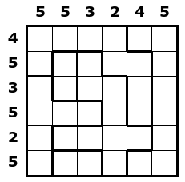
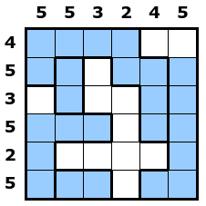

# Problem 1

Your friend Neptune asks for your help to start a new business in the town.

You are given a square grid divided into blocks, and with numeric clues on each row and column.
Water can be put into cells, obeying gravity low and a beauty criterion:
the water level in each block is one and the same across its full width.
Clues are there to impose the number of filled cells in each row and column of the grid, as required by the customer who commissioned the work.

Help Neptune to decide where the water should go.


## Input format

The first line contains one integer, `S`, the size of the grid.
The second line contains `S` integers, the column clues.
The third line contains `S` integers, the row clues.
The following `S` lines contain `S` integers each, denoting the block of each cell of the grid.


## Output format

`S` lines of `S` chars each, where `.` denotes a free cell, and `*` denotes a cell with water.


## Constraints

Instances are guaranteed to satisfy the following constraints:

* `S` between 6 and 30
* at most 100 blocks


## Example

Instance:

```
6
5 5 3 2 4 5
4 5 3 5 2 5
1 1 1 1 2 2
1 3 4 1 1 2
5 3 4 4 1 2
5 5 5 4 1 2
5 4 4 4 4 2
5 6 6 4 2 2
```



Expected output:

```
****..
**.***
.*..**
***.**
*....*
***.**
```



SHA-1 of the expected output: `644a4a0c3bc94aad7d633a0077e70cfa0642aa2a`

Characters in the expected output: `42`


## Self-check your solution before submission

SHA-1 of the expected output:

```
$ sha1sum instance.*.out
7a4684a8fd9a4d893f1273c109e8c13f593bc882  instance.0.out
7449f2646853730d7f4d7a7a1beaf3da95199d02  instance.1.out
2f84ba8cfebc117674a065555228899a19a698e5  instance.2.out
e77d7d059220230cb526155f4e2b326c19a51c01  instance.3.out
362204ad44fa918a71809960cc19049a2cf3c75f  instance.4.out
71e9034adc7e41ab16d8eee07af8d6fcc3d9ae13  instance.5.out
```

Characters in the expected output:

```
$ wc -c instance.*.out
  42 instance.0.out
 110 instance.1.out
 240 instance.2.out
 420 instance.3.out
 650 instance.4.out
 930 instance.5.out
```
