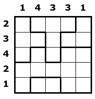
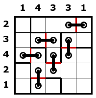

# Problem 2

*The problem is named Stitches, and can be played [here](https://www.puzzle-stitches.com/).*

Your friend Giorgio Arcani is asking for your help to run his business.

You are given a square grid divided into blocks, and with numeric clues on each row and column.
Each block must be connected with all its neighbor blocks with exactly `N` stitches, where a stitch connects 2 orthogonally adjacent cells from different blocks, causing two holes on those cells.
Holes cannot be shared between different stitches cannot share hole.
Clues are there to impose the number of holes in each row and column of the grid, as required by stylist.


## Input format

The first line contains two integers, `S` and `N`, the size of the grid and the number of required connections.
The second line contains `S` integers, the column clues.
The third line contains `S` integers, the row clues.
The following `S` lines contain `S` integers each, denoting the block of each cell of the grid.


## Output format

A line containing one integer, `H`, representing the number of horizontal stitches, followed by `H` lines containing two integers and representing the left cell of a horizontal stitch;
stitches must be provided in lexicographical order.
After that, a line containing one integer, `V`, representing the number of vertical stitches, followed by `V` lines containing two integers and representing the top cell of a vertical stitch;
stitches must be provided in lexicographical order.


## Constraints

* `S` between 5 and 20
* `N` between 1 and 5
* at most 50 blocks


## Example

Instance:

```
5 1
1 4 3 3 1
2 3 4 2 1
1 2 2 2 3
1 1 2 3 3
1 4 2 4 4
4 4 4 4 4
4 5 5 4 4
```



Expected output:

```
3
1 4
2 2
3 1
3
2 4
3 3
4 2
```



SHA-1 of the expected output: `048725cf726b5c043c3ddbe8005ecd6dd9e84390`

Characters in the expected output: `28`


## Self-check your solution before submission

SHA-1 of the expected output:

```
$ sha1sum instance.*.out
fd62b0857057838aab41bb3fd78f91f89363eb07  instance.0.out
ed9fc42b784db304448ed7723ed284790c5ed42a  instance.1.out
41dbbd4f5ed6ba9dc3001fd063860ed591d3fcec  instance.2.out
b33b842fac6fbae0ec3d058453183a252fd37ef8  instance.3.out
1a3765f6fb7367f516679ce246b907e418636780  instance.4.out
c5783832ae6fcb912050c119081288f3781af15b  instance.5.out
```

Characters in the expected output:

```
$ wc -c instance.*.out
 28 instance.0.out
 52 instance.1.out
 75 instance.2.out
203 instance.3.out
192 instance.4.out
296 instance.5.out
```
