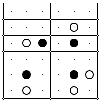
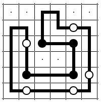

# Problem 4

Your friend Enzo Ferrara is asking for your help to sketch a new speed circuit.

You are given a square grid with some cells containing white or black circles.
The grid is essentially the area hosting the circuit, and circles denote already built grandstands (of two types, straight and curved).
Adjacent cells can be connected (representing a piece of the circuit), no crossing or branches are permitted, and one single loop must be constructed.
Additionally, white circles must be passed through in a straight line, but the loop must turn in the previous and/or the next cell;
black circles must be turned upon and the loop must travel straight through the next and the previous cell.
All white and black circles must be part of the loop.


## Input format

The first line contains three integers, `S`, `W` and `B`, the largest index in the grid (i.e., the size of the grid minus 1), and the number of white and black circles.
The following `W` lines contains two integers each, the coordinates of cells with white circles (0-indexed).
The following `B` lines contains two integers each, the coordinates of cells with black circles (0-indexed).


## Output format

A line containing one integer, `H`, representing the number of horizontal connections, followed by `H` lines containing two integers and representing the left cell of a horizontal connection;
connections must be provided in lexicographical order.
After that, a line containing one integer, `V`, representing the number of vertical connections, followed by `V` lines containing two integers and representing the top cell of a vertical connection;
connections must be provided in lexicographical order.


## Constraints

* `S` between 5 and 40
* `W` and `B` between 1 and 300


## Example

Instance:

```
5 5 4
1 4
2 1
4 5
5 1
5 4
2 2
2 4
4 1
4 4
```



Expected output:

```
14
0 2
1 0
1 3
1 4
2 2
2 3
4 1
4 2
4 3
5 0
5 1
5 2
5 3
5 4
16
0 2
0 3
1 0
1 1
1 2
1 5
2 0
2 1
2 4
2 5
3 0
3 1
3 4
3 5
4 0
4 5
```



SHA-1 of the expected output: `074b7f2f5c8eb7f10e69f8aecdf626f887504195`

Characters in the expected output: `126`


## Self-check your solution before submission

SHA-1 of the expected output:

```
$ sha1sum instance.*.out
f2a01ce481d96c7bb784c70acc6a6a94c2cb8746  instance.0.out
45460d44e0e4fc30ddb0588ecce7e1e3fe7f18a2  instance.1.out
23689f4c968249e5c31947bd70ef30593be35248  instance.2.out
a4bb1f7897e023625118f2eab3b89b3244aa8ca7  instance.3.out
d06e676b5d94bddc540412e5bb951a763da60c05  instance.4.out
dd03fd7c65ca70e702a709c70ca6eb29d9a4b422  instance.5.out
```

Characters in the expected output:

```
$ wc -c instance.*.out
  118 instance.0.out
  928 instance.1.out
 2845 instance.2.out
 4161 instance.3.out
 5771 instance.4.out
 7596 instance.5.out
```
